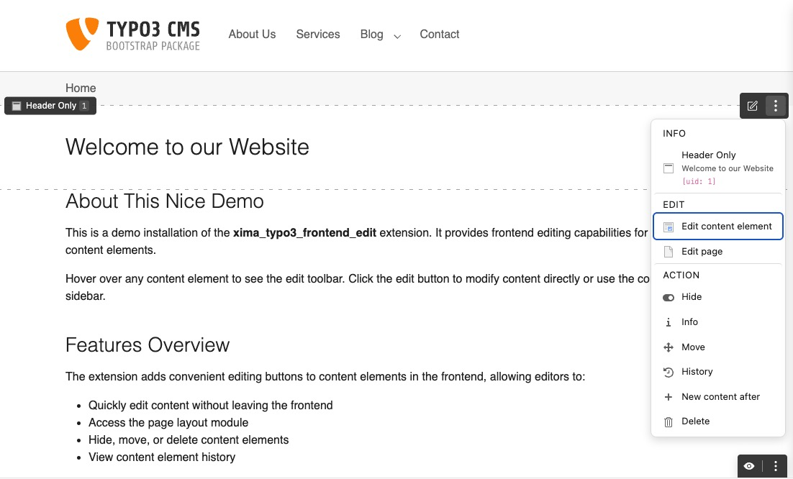
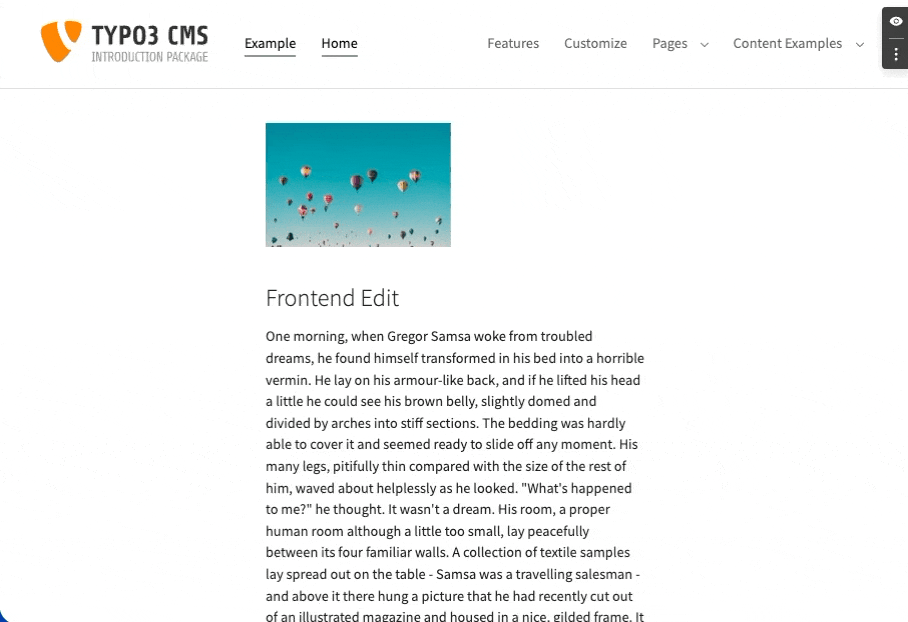

<div align="center">


# TYPO3 extension `xima_typo3_frontend_edit`

[](https://extensions.typo3.org/extension/xima_typo3_frontend_edit)
[](https://extensions.typo3.org/extension/xima_typo3_frontend_edit)
[](https://packagist.org/packages/xima/xima-typo3-frontend-edit)
[](https://github.com/xima-media/xima-typo3-frontend-edit/actions/workflows/cgl.yml)
[](https://github.com/xima-media/xima-typo3-frontend-edit/actions/workflows/tests.yml)
[](LICENSE.md)

</div>

This extension provides an edit menu for editors within the frontend regarding content elements and pages.



> [!NOTE]
> **Delineation and classification**: This is **not** a further development of the "original" extension [frontend_editing](https://extensions.typo3.org/extension/frontend_editing). It is similar in some ways to the realisation of the [feedit](https://extensions.typo3.org/extension/feedit) extension. This extension is an independent implementation with a different approach.
>
> Unlike [content_preview](https://github.com/T3-UX/content_preview), which provides a split-view with live frontend preview within the backend Page module, this extension works directly in the frontend and does not modify the backend interface.

The extension has been developed to provide a simple and lightweight solution to easily start the editing of content elements from the frontend and thus reduce the gap between frontend and backend. Therefore, a simple javascript is injected into the frontend, which generates action links to the TYPO3 backend with the corresponding edit views.

## ✨ Features

- **Edit Menu** - Quick access to edit, hide, delete, and move content elements
- **Toolbar** - Page-level actions and toggle for frontend editing
- **Site Settings** - Per-site configuration via YAML
- **PSR-14 Events** - Customize menus with custom actions
- **Data ViewHelper** - Add edit links for related records (e.g., news items)
- **Dark/Light Mode** - Automatic or manual color scheme selection
- **Configurable Position** - 12 toolbar positions available
- **Save & Close** - Quick return to frontend after editing

## 🔥 Installation

### Requirements

* TYPO3 >= 13.4
* PHP 8.2+

### Supports

| **Version** | **TYPO3** | **PHP** |
|-------------|-----------|---------|
| 2.x         | 13-14     | 8.2-8.5 |
| 1.x         | 11-13     | 8.1-8.5 |

### Composer

[](https://packagist.org/packages/xima/xima-typo3-frontend-edit)
[](https://packagist.org/packages/xima/xima-typo3-frontend-edit)

``` bash
composer require xima/xima-typo3-frontend-edit
```

### TER

[](https://extensions.typo3.org/extension/xima_typo3_frontend_edit)
[](https://extensions.typo3.org/extension/xima_typo3_frontend_edit)

Download the zip file from [TYPO3 extension repository (TER)](https://extensions.typo3.org/extension/xima_typo3_frontend_edit).

## 📙 Documentation

Please have a look at the
[official extension documentation](https://docs.typo3.org/p/xima/xima-typo3-frontend-edit/main/en-us/Index.html).




> [!NOTE]
> Facing trouble or issues? You may find help in the following sections:
> - [How it works](https://docs.typo3.org/p/xima/xima-typo3-frontend-edit/main/en-us/HowItWorks/Index.html)
> - [Migration](https://docs.typo3.org/p/xima/xima-typo3-frontend-edit/main/en-us/Migration/Index.html)
> - [FAQ](https://docs.typo3.org/p/xima/xima-typo3-frontend-edit/main/en-us/FAQ/Index.html)

## 🧑‍💻 Contributing

Please have a look at [`CONTRIBUTING.md`](CONTRIBUTING.md).

## 💎 Credits

The extension icon based on  the original
[`actions-open`](https://typo3.github.io/TYPO3.Icons/icons/actions/actions-open.html) icon from TYPO3 core which is 
originally licensed under [MIT License](https://github.com/TYPO3/TYPO3.Icons/blob/main/LICENSE).

Thanks to [move:elevator](https://www.move-elevator.de/) and [XIMA](https://www.xima.de/) for supporting the development of this extension.

## ⭐ License

This project is licensed
under [GNU General Public License 2.0 (or later)](LICENSE.md).
