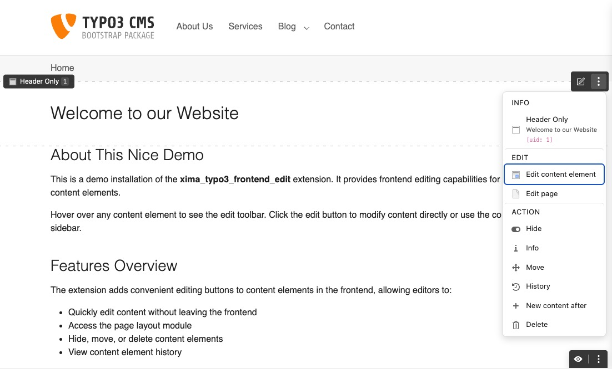
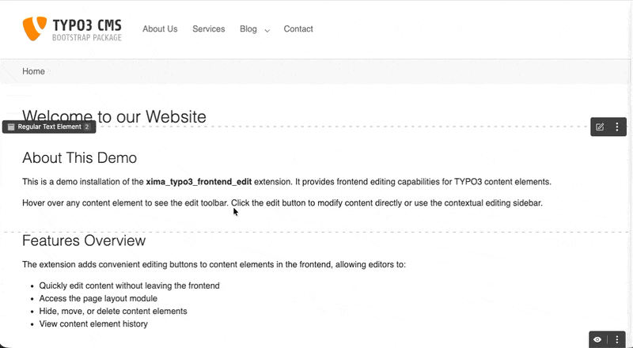
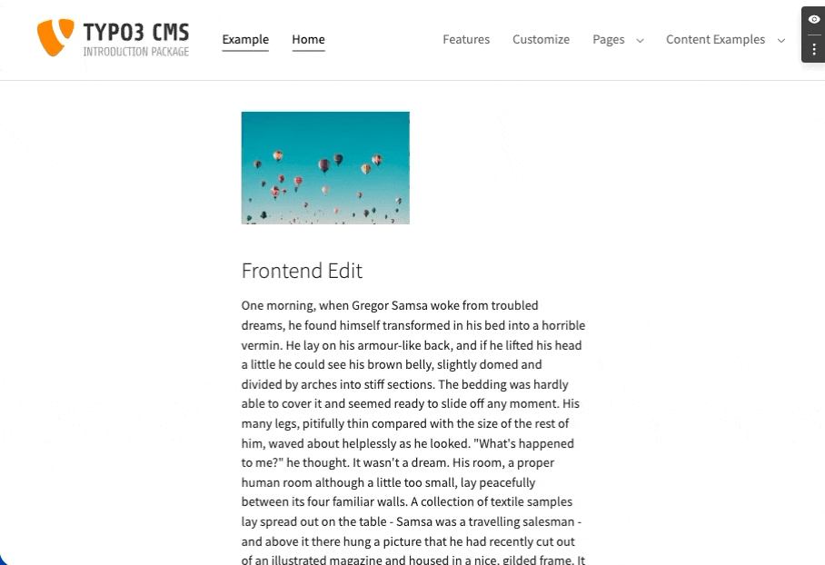

<div align="center">


# TYPO3 extension `xima_typo3_frontend_edit`

[](https://extensions.typo3.org/extension/xima_typo3_frontend_edit)
[](https://extensions.typo3.org/extension/xima_typo3_frontend_edit)
[](https://packagist.org/packages/xima/xima-typo3-frontend-edit)
[](https://github.com/xima-media/xima-typo3-frontend-edit/actions/workflows/cgl.yml)
[](https://github.com/xima-media/xima-typo3-frontend-edit/actions/workflows/tests.yml)
[](LICENSE.md)

</div>

This TYPO3 extension adds lightweight editing tools to the frontend, allowing backend users to edit, hide, delete, and reorder content elements and pages without leaving the site.



> [!IMPORTANT]
> **Delineation and classification**: This is **not** a further development of the "original" extension [frontend_editing](https://extensions.typo3.org/extension/frontend_editing). It is similar in some ways to the realisation of the [feedit](https://extensions.typo3.org/extension/feedit) extension. This extension is an independent implementation with a different approach. See the [Delineation](https://docs.typo3.org/p/xima/xima-typo3-frontend-edit/main/en-us/Delineation/Index.html) page in the documentation for a detailed comparison with related extensions like [visual_editor](https://github.com/FriendsOfTYPO3/visual_editor) and [content_preview](https://github.com/T3-UX/content_preview).

The extension injects a small JavaScript into the frontend that generates action links to the TYPO3 backend, bridging the gap between frontend preview and backend editing.

> [!NOTE]
> **Why?** TYPO3 editors often need to switch between the frontend and the backend to find and edit the right content element. This extension eliminates that context switch by providing editing actions directly where the content is displayed — making the editorial workflow faster and more intuitive.

## ✨ Features

- **Content Element Editing**
  - **[Edit Menu](https://docs.typo3.org/p/xima/xima-typo3-frontend-edit/main/en-us/Usage/EditMenu.html)** - Quick access to edit, hide, delete, and move content elements
  - **[Delete Confirmation](https://docs.typo3.org/p/xima/xima-typo3-frontend-edit/main/en-us/Usage/EditMenu.html#delete-confirmation)** - Confirmation dialog before deleting records *(new in v2.3)*
  - **[Inline Editing](https://docs.typo3.org/p/xima/xima-typo3-frontend-edit/main/en-us/Usage/ContextualEditing.html)** *(experimental)* - Edit content directly in the frontend (v13: iframe modal, v14.2+: contextual sidebar)
- **Page Toolbar**
  - **[Toolbar](https://docs.typo3.org/p/xima/xima-typo3-frontend-edit/main/en-us/Usage/Toolbar.html)** - Page-level actions and toggle for frontend editing
  - **Dark/Light Mode** - Automatic or manual color scheme selection
  - **Configurable Position** - 12 toolbar positions available
- **Configuration**
  - **[Site Settings](https://docs.typo3.org/p/xima/xima-typo3-frontend-edit/main/en-us/Configuration/SiteSettings.html)** - Per-site configuration via YAML
  - **[UserTSconfig](https://docs.typo3.org/p/xima/xima-typo3-frontend-edit/main/en-us/Configuration/UserTSconfig.html)** - Disable frontend editing per user or user group
- **Developer**
  - **[PSR-14 Events](https://docs.typo3.org/p/xima/xima-typo3-frontend-edit/main/en-us/DeveloperCorner/Events.html)** - Customize menus with custom actions
  - **ViewHelpers** - [Data attributes](https://docs.typo3.org/p/xima/xima-typo3-frontend-edit/main/en-us/DeveloperCorner/DataAttributes.html) for related records, [empty column buttons](https://docs.typo3.org/p/xima/xima-typo3-frontend-edit/main/en-us/DeveloperCorner/EmptyColumns.html) for new content *(new in v2.3)*

> [!NOTE]
> **New in v2.3.0 — Inline Editing** *(experimental)*
>
> Edit content elements directly in the frontend without navigating to the backend. Enable via Site Settings: `frontendEdit.enableContextualEditing: true`
>
> - **TYPO3 v13**: Opens a slide-in iframe modal
> - **TYPO3 v14.2+**: Uses the native contextual editing sidebar (introduced in v2.2.0)
>
> 
>
> [Documentation](https://docs.typo3.org/p/xima/xima-typo3-frontend-edit/main/en-us/Usage/ContextualEditing.html)

## 🔥 Installation

### Requirements

* TYPO3 >= 13.4
* PHP 8.2+

### Supports

| **Version** | **TYPO3** | **PHP** |
|-------------|-----------|---------|
| 2.x         | 13-14     | 8.2-8.5 |
| 1.x         | 11-13     | 8.1-8.5 |

### Composer

[](https://packagist.org/packages/xima/xima-typo3-frontend-edit)
[](https://packagist.org/packages/xima/xima-typo3-frontend-edit)

``` bash
composer require xima/xima-typo3-frontend-edit
```

### TER

[](https://extensions.typo3.org/extension/xima_typo3_frontend_edit)
[](https://extensions.typo3.org/extension/xima_typo3_frontend_edit)

Download the zip file from [TYPO3 extension repository (TER)](https://extensions.typo3.org/extension/xima_typo3_frontend_edit).

## 📙 Documentation

Please have a look at the
[official extension documentation](https://docs.typo3.org/p/xima/xima-typo3-frontend-edit/main/en-us/Index.html).




> [!NOTE]
> Facing trouble or issues? You may find help in the following sections:
> - [How it works](https://docs.typo3.org/p/xima/xima-typo3-frontend-edit/main/en-us/HowItWorks/Index.html)
> - [Migration](https://docs.typo3.org/p/xima/xima-typo3-frontend-edit/main/en-us/Migration/Index.html)
> - [FAQ](https://docs.typo3.org/p/xima/xima-typo3-frontend-edit/main/en-us/FAQ/Index.html)

## 🧑‍💻 Contributing

Please take a look at [Contributing](CONTRIBUTING.md).

## 💎 Credits

Thanks to [move:elevator](https://www.move-elevator.de/) and [XIMA](https://www.xima.de/) for supporting the development of this extension.

## ⭐ License

This project is licensed
under [GNU General Public License 2.0 (or later)](LICENSE.md).
