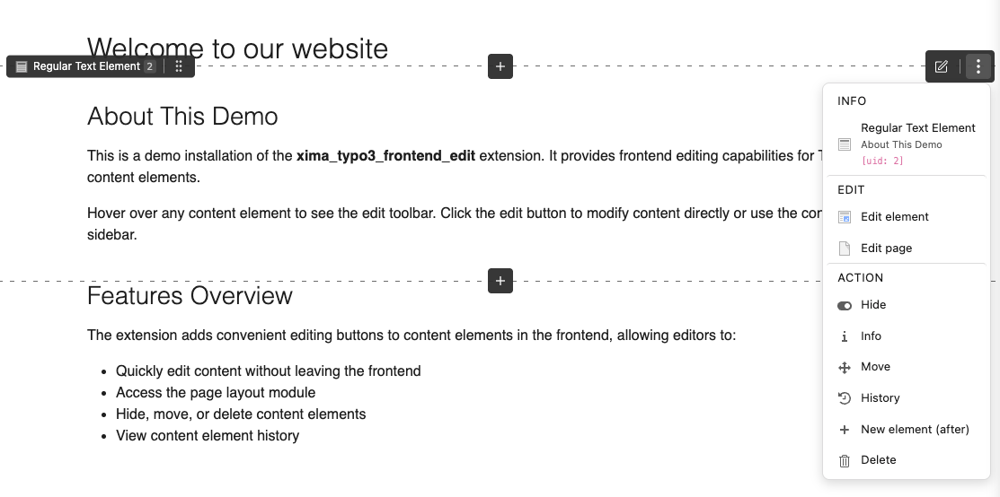
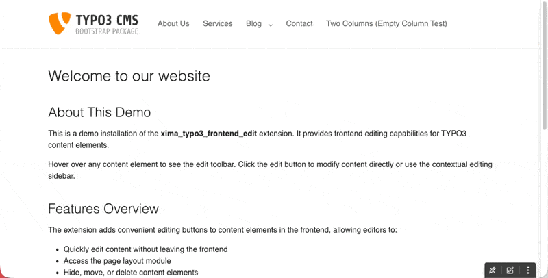
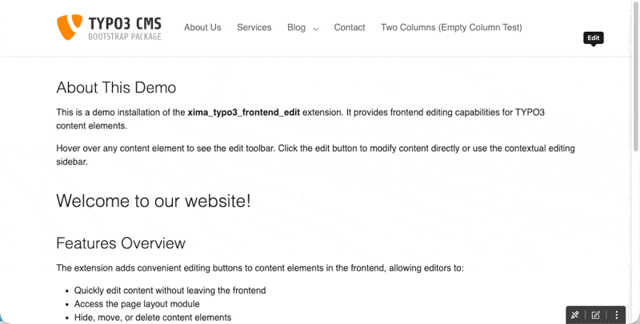

<div align="center">


# TYPO3 extension `xima_typo3_frontend_edit`

[](https://extensions.typo3.org/extension/xima_typo3_frontend_edit)

[](https://packagist.org/packages/xima/xima-typo3-frontend-edit)
[](https://coveralls.io/github/xima-media/xima-typo3-frontend-edit)
[](https://github.com/xima-media/xima-typo3-frontend-edit/actions/workflows/cgl.yml)
[](https://github.com/xima-media/xima-typo3-frontend-edit/actions/workflows/tests.yml)
[](LICENSE.md)

Edit, hide, delete, reorder and create TYPO3 content, without leaving the frontend.

</div>

It adds an edit button to every content element, a page-level toolbar, and optional inline editing and drag & drop, all rendered directly on top of the live frontend.



> [!NOTE]
> **Why?** TYPO3 editors constantly switch between frontend and backend just to find the right content element. This extension removes that context switch: the editing actions appear exactly where the content is displayed.

<details>
<summary><b>See it in action</b></summary>

Edit menu and page toolbar:



Create new content, using insert buttons that open TYPO3's native New Content wizard:



</details>

## ✨ Features

| Feature | What it does |
|---|---|
| [Edit Menu](https://docs.typo3.org/p/xima/xima-typo3-frontend-edit/main/en-us/Usage/EditMenu.html) | Edit, hide, delete, move, info and history per content element, with a confirmation dialog before deleting |
| [Toolbar](https://docs.typo3.org/p/xima/xima-typo3-frontend-edit/main/en-us/Usage/Toolbar.html) | Page-level actions and a toggle to switch frontend editing on and off |
| [Inline Editing](https://docs.typo3.org/p/xima/xima-typo3-frontend-edit/main/en-us/Usage/InlineEditing.html) | (experimental, opt-in) Edit content and page properties in a panel next to the page: sidebar on TYPO3 v14.2+, slide-in modal on v13 |
| [New content](https://docs.typo3.org/p/xima/xima-typo3-frontend-edit/main/en-us/Integration/ColumnTargets.html) | Insert buttons on hover and per column, opening TYPO3's native New Content Element Wizard |
| [Drag & Drop](https://docs.typo3.org/p/xima/xima-typo3-frontend-edit/main/en-us/Usage/DragAndDrop.html) | (experimental, opt-in) Reorder elements within a column or move them into another column, incl. `EXT:container` |
| [Site Settings](https://docs.typo3.org/p/xima/xima-typo3-frontend-edit/main/en-us/Configuration/SiteSettings.html) | Per-site configuration via YAML: appearance, toolbar position, and filters for pages, doktypes, CTypes and UIDs |
| [UserTSconfig](https://docs.typo3.org/p/xima/xima-typo3-frontend-edit/main/en-us/Configuration/UserTSconfig.html) | Disable frontend editing per backend user or user group |
| [PSR-14 Events](https://docs.typo3.org/p/xima/xima-typo3-frontend-edit/main/en-us/DeveloperCorner/Events.html) & [ViewHelpers](https://docs.typo3.org/p/xima/xima-typo3-frontend-edit/main/en-us/DeveloperCorner/DataAttributes.html) | Add custom menu entries, attach data to elements, add edit links for related records |

## 🔥 Installation

### Requirements

* TYPO3 >= 13.4
* PHP 8.2+

See [Setup requirements & limits](https://docs.typo3.org/p/xima/xima-typo3-frontend-edit/main/en-us/Configuration/SetupRequirementsAndLimits.html) for multi-domain setups, external caches (Varnish/CDN), the content element anchor pattern requirement (and the headless/SPA non-goal), and preview links.

### Supports

| **Version** | **TYPO3** | **PHP** |
|-------------|-----------|---------|
| 2.x         | 13-14     | 8.2-8.5 |
| 1.x         | 11-13     | 8.1-8.5 |

### Composer

[](https://packagist.org/packages/xima/xima-typo3-frontend-edit)
[](https://packagist.org/packages/xima/xima-typo3-frontend-edit)

``` bash
composer require xima/xima-typo3-frontend-edit
```

### TER

[](https://extensions.typo3.org/extension/xima_typo3_frontend_edit)
[](https://extensions.typo3.org/extension/xima_typo3_frontend_edit)

Download the zip file from [TYPO3 extension repository (TER)](https://extensions.typo3.org/extension/xima_typo3_frontend_edit).

> [!TIP]
> Nothing showing up? Custom templates need to expose a content element ID (`id="c123"`). The [FAQ](https://docs.typo3.org/p/xima/xima-typo3-frontend-edit/main/en-us/FAQ/Index.html) walks through the six usual causes.

## 📙 Documentation

[**Read the full documentation**](https://docs.typo3.org/p/xima/xima-typo3-frontend-edit/main/en-us/Index.html): installation, all configuration options, usage guide and developer reference.

- [First steps](https://docs.typo3.org/p/xima/xima-typo3-frontend-edit/main/en-us/Usage/FirstSteps.html): a short tour for editors
- [Integration](https://docs.typo3.org/p/xima/xima-typo3-frontend-edit/main/en-us/Integration/Index.html): what your site package has to provide
- [Keyboard](https://docs.typo3.org/p/xima/xima-typo3-frontend-edit/main/en-us/Usage/Keyboard.html): operating it without a mouse
- [How it works](https://docs.typo3.org/p/xima/xima-typo3-frontend-edit/main/en-us/DeveloperCorner/Architecture.html): what gets injected and why
- [FAQ](https://docs.typo3.org/p/xima/xima-typo3-frontend-edit/main/en-us/FAQ/Index.html): troubleshooting
- [Migration](https://docs.typo3.org/p/xima/xima-typo3-frontend-edit/main/en-us/Migration/Index.html): upgrading from 1.x to 2.x
- [Comparison](https://docs.typo3.org/p/xima/xima-typo3-frontend-edit/main/en-us/Delineation/Index.html): how it differs from similar extensions

> [!IMPORTANT]
> This is **not** a further development of [frontend_editing](https://extensions.typo3.org/extension/frontend_editing). It is an independent implementation with a different approach, closer in spirit to [feedit](https://extensions.typo3.org/extension/feedit). See the [comparison](https://docs.typo3.org/p/xima/xima-typo3-frontend-edit/main/en-us/Delineation/Index.html) for details.

## 🧑‍💻 Contributing

Please take a look at [Contributing](CONTRIBUTING.md).

## 💎 Credits

Thanks to [move:elevator](https://www.move-elevator.de/) and [XIMA](https://www.xima.de/) for supporting the development of this extension, and to [Violetta Digital Craft](https://www.violetta.ch/) for supporting the inline editing feature.

## ⭐ License

This project is licensed under [GNU General Public License 2.0 (or later)](LICENSE.md).
